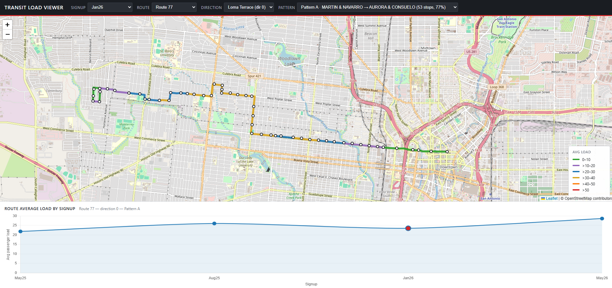

# Load Factor Analysis

A local web application for visualizing transit passenger load factors across stops, directions, and trip patterns — used to measure the impact of service changes between scheduling signups.

> **Status:** Demo . Loads are synthesized from a deterministic model on top of GTFS schedule geometry. The architecture is designed to drop in real automatic passenger counter (APC) data without touching the frontend.

---

## The problem

Transit planners need a way to measure the success or failure of service improvements after they are implemented. The conventional approach — comparing scalar ridership numbers between months — flattens away the spatial detail that matters most: *where on the route is load actually changing?*

A load increase concentrated at the route's downtown stops tells a very different story than the same increase distributed evenly. A short-turn pattern that consistently runs near capacity while the full pattern runs half-empty is a service-design problem invisible to a route-level average.

This tool answers questions at the granularity planners actually work in:

- **By stop** — load factor at each individual boarding location, not just an aggregate
- **By direction** — northbound and southbound serve different rider populations and respond differently to changes
- **By pattern** — short turns, branches, and express variants get their own line on the map and chart
- **By time period** — currently signup-to-signup; the architecture supports daily actuals or monthly averages with no schema change

Each segment between two stops is colored by the average load departing the upstream stop, so a planner can scan the map and see immediately where a route is loaded vs. underused. The line chart below the map shows that pattern's average load trending across all available signups, with the currently-selected signup highlighted.

---

## Sample Output
| | |
|---|---|
| |

---

## Quick start

This runs on macOS, Windows, and Linux. ~2 minutes if Python is already installed.

```bash
# 1. Clone and enter
git clone https://github.com/yourusername/load-factor-analysis.git
cd load-factor-analysis

# 2. Create and activate a virtual environment
python -m venv .venv
source .venv/bin/activate          # macOS / Linux
# .venv\Scripts\activate           # Windows (Command Prompt)

# 3. Install dependencies
pip install -r requirements.txt

# 4. Generate synthetic GTFS for two demo routes across four signups
python scripts/make_sample_gtfs.py

# 5. Process GTFS into segment GeoJSON + load CSV + metadata
python scripts/generate_dummy_data.py

# 6. Run the app
python app.py
```

Open http://localhost:5000.

To use real GTFS feeds instead of synthetic data, skip step 4, drop your zips into `data/gtfs/<signup>/` (one per signup folder), update `ROUTES_OF_INTEREST` at the top of `scripts/generate_dummy_data.py` to your route short names, and run steps 5 and 6.

---

## How it works

### Tech stack

| Layer | Choice | Why |
|---|---|---|
| Backend | Flask | Smallest viable web framework for a localhost dashboard; zero ceremony |
| Geospatial | Shapely | Industry-standard for projection and segment cutting; pure Python, no PostGIS needed |
| Data | pandas | Familiar transit-analytics tool; handles GTFS shapes naturally |
| Map | Leaflet.js | Free, no API key, ubiquitous in transit dashboards |
| Charts | Chart.js | Drop-in, no build step |
| Frontend | Vanilla JS | Keeps the cognitive load low; no framework needed for two interactive components |

### Data flow

```
GTFS zips ─┐
           ├─► generate_dummy_data.py ─┬─► load_data.csv      (wide format)
           │                           ├─► segments.geojson  (one feature per stop pair)
           │                           ├─► stops.geojson     (one feature per stop visit)
           │                           └─► route_meta.json   (filter dropdowns)
           │
           └─► make_sample_gtfs.py (only used in demo mode)

Generated artifacts ──► Flask backend ──► /api/{meta,segments,stops,trend} ──► Frontend
```

The generator is the analytical core. The Flask layer is intentionally thin: filter pre-computed GeoJSON by query parameters and serve. The frontend just renders what the backend hands it. This lets the tool scale to real-time AVL feeds later by replacing the generator without touching the rest.

### Geospatial approach

For each (signup, route, direction, pattern), the generator:

1. Loads `shapes.txt` and reconstructs a Shapely `LineString` for the pattern's `shape_id`
2. Loads the canonical stop sequence from `stop_times.txt` (longest trip wins as a tiebreaker for short-turn artifacts)
3. Projects each stop onto the line with `LineString.project()` to find its position along the route
4. Cuts the line at consecutive stop positions using `shapely.ops.substring`, producing N−1 colored segments for N stops
5. Tags each segment with its upstream stop's load value (passengers leaving stop A heading toward stop B — standard transit convention)

If a feed has no `shapes.txt`, segments fall back to straight lines between consecutive stops without the rest of the pipeline knowing.

### Pattern detection

A *pattern* is a unique `shape_id` within a (route, direction). One route typically has multiple patterns:

- A **full** run from terminal to terminal
- **Short turns** that end before the full terminal during off-peak
- **Branches** that split at a junction
- **Express variants** that skip selected stops

Patterns are letter-coded **A, B, C…** by trip count *per signup*. Pattern A always means *the most-frequent pattern in this signup*, which can be a different shape if service was restructured between signups — that is intentional, so the trend chart shows "how is the dominant pattern's load changing" across time.

Patterns accounting for less than 2% of trips are dropped to filter out detour artifacts and data-entry errors. The threshold is configurable.

### Color thresholds

| Avg load | Color | Hex |
|---|---|---|
| 0–10 | green  | #2ca02c |
| >10–20 | violet | #9467bd |
| >20–30 | blue   | #1f77b4 |
| >30–40 | gold   | #daa520 |
| >40–50 | orange | #ff7f0e |
| >50    | red    | #d62728 |

Defined once in `LOAD_COLORS` at the top of `scripts/generate_dummy_data.py`. Re-run the generator after changes.

---

## Project structure

```
load-factor-analysis/
├── app.py                          # Flask backend
├── requirements.txt
├── README.md
├── LICENSE
├── data/
│   └── gtfs/
│       ├── may25/sample_gtfs.zip   # generated by make_sample_gtfs.py
│       ├── aug25/sample_gtfs.zip
│       ├── jan26/sample_gtfs.zip
│       └── may26/sample_gtfs.zip
├── scripts/
│   ├── make_sample_gtfs.py         # synthetic GTFS for the demo
│   └── generate_dummy_data.py      # GTFS → load CSV + GeoJSON
├── static/
│   ├── css/style.css
│   └── js/app.js
├── templates/
│   └── index.html
└── docs/
    └── screenshots/                # add your screenshots here
```

Generated outputs (`load_data.csv`, `segments.geojson`, `stops.geojson`, `route_meta.json`) are gitignored — regenerate with the script.

---

## Customization

**Different routes.** Edit `ROUTES_OF_INTEREST` in `scripts/generate_dummy_data.py` to match `route_short_name` values in your GTFS feed.

**Different signup periods.** Edit `SIGNUPS` and `SIGNUP_LABELS` at the top of `scripts/generate_dummy_data.py`. The folder names under `data/gtfs/` must match.

**Different load thresholds.** Edit `LOAD_COLORS` in the same file. The legend in the UI updates automatically because it's served from `/api/meta`.

**Real load data instead of synthesized.** Replace the `synthesize_load()` function with a CSV/database lookup keyed by `(stop_id, route, direction_id, pattern_letter, signup)`. The rest of the pipeline is agnostic to where the values come from. This is the natural extension point for plugging in APC data.

**Different segment color rule.** The default is *upstream stop's load colors the segment*. To use the downstream stop's load instead, change the lookup key from `from_id` to `seg["to_stop"]` in the segment-feature loop.

---

## Roadmap

Ideas for further development. None of these are implemented; they're listed to show where the architecture is designed to go:

- **Replace synthesized loads with real APC data.** Function-level swap in the generator. The frontend doesn't change.
- **Time-of-day filtering.** Peak / midday / evening / late-night windows are common planning cuts. Adds a 5th dropdown and a `period` parameter to the load lookup.
- **Day-of-week filtering.** Weekday vs Saturday vs Sunday. Same shape as time-of-day.
- **Boarding/alighting breakdown.** Load is net; on/off counts at each stop tell the actual demand story. Two extra columns in the CSV, two layered map views.
- **Side-by-side route comparison.** Show two routes' load profiles simultaneously to evaluate corridor competition or service overlap.
- **Variance/confidence visualization.** When load values come from real data, surface their variance — a stop with average load 25 but daily values ranging 5–50 is operationally different from one with 25±2.
- **Export to GIS.** Save the colored-segment layer as Shapefile or File Geodatabase for use in ArcGIS Pro reports.
- **Production deployment.** Containerize and put behind a real WSGI server (gunicorn + nginx). Add basic auth for internal staff use.

---

## License

MIT — see [LICENSE](LICENSE).

## Author

Built by Andrew Reyna, a transit planner / data analyst based in San Antonio.
with a background in Urban Planning. Find me at adrsub22@gmail.com
